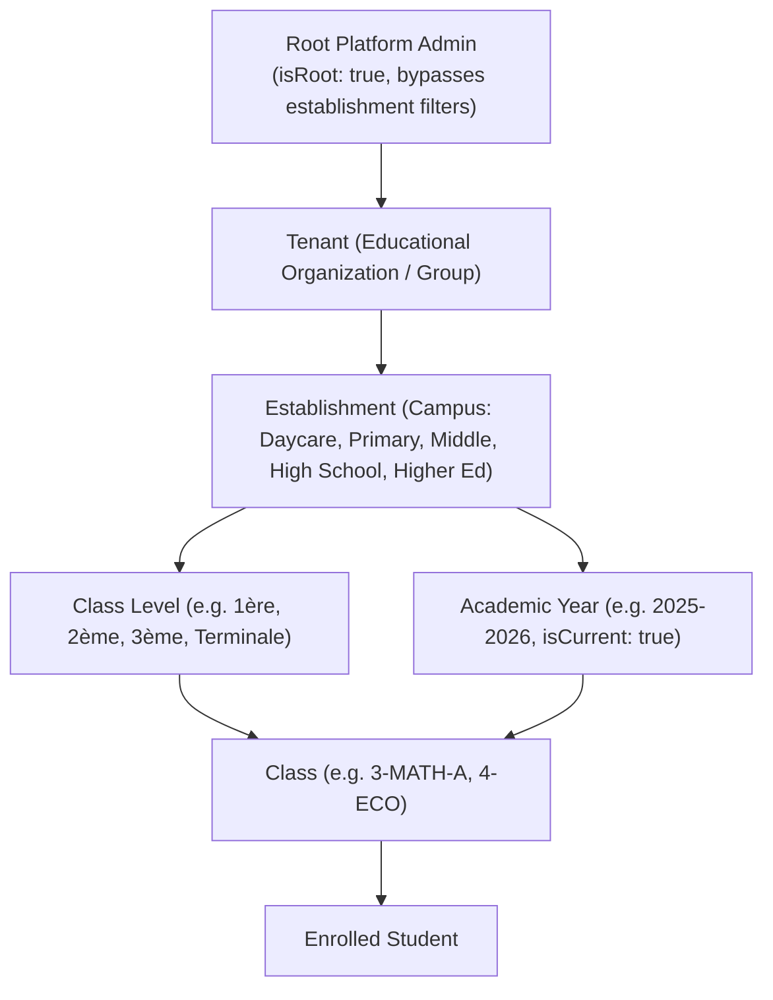

# BSofts-School — Business Logic & Domain Specifications

> Comprehensive guide to business rules, tenant boundaries, academic structures, grading, financial operations, and audit governance.  
> **Last Updated**: 2026-09-22

---

## 1. Multi-Tenancy Hierarchy & Scoping

### Context Injection on Every HTTP Request
All frontend API requests pass:
* `x-tenant-id`: Identifies the organization.
* `x-establishment-id`: Identifies the current physical campus. If set to `ALL`, Root users can view cross-campus records.
* `x-academic-year-id`: Identifies the active school year for timetable, enrollment, and grade calculations.

---

## 2. Audit Trail & Soft-Delete Standards

All 45 primary domain models support:
* `createdBy String?`: User ID or snapshot of the creator.
* `updatedBy String?`: User ID or snapshot of the last modifier.
* `isDeleted Boolean @default(false)`: Soft-deletion indicator.
* `deletedAt DateTime?`: Timestamp when record was sent to the trash.
* `deletedBy String?`: Actor who deleted the record.

### Permanent Deletion Rule
* Standard users can only perform soft deletion (`isDeleted = true`).
* Permanent deletion (`?permanent=true`) is strictly restricted to **Root Administrators** (`isRoot = true`).
* Whenever a permanent delete fails due to foreign key constraints, an error is recorded in `SystemLog`.

---

## 3. Dynamic Enum Engine & SmtpConfig

### DynamicEnum Resolution
* Table: `DynamicEnum` (composite unique key on `[establishmentId, category, code]`).
* Categories:
  * `PAYMENT_METHOD`: Cash, Cheque, Virement, Carte Bancaire, Traite.
  * `TEACHER_SPECIALIZATION`: Mathématiques, Physique-Chimie, Français, Arabe, Anglais, SVT, Informatique.
  * `EMPLOYEE_DEPARTMENT`: Direction, Administration, Comptabilité, Surveillance Générale, Maintenance, Sécurité.
  * `STUDENT_STATUS`: Inscrit, Transféré, Démissionnaire, Exclu.
* Endpoints:
  * `GET /api/dynamic-enums`: List all establishment enums.
  * `GET /api/dynamic-enums/category/:category`: Filter active enum options for UI dropdown selects.

### Dynamic SMTP Configuration
* Table: `SmtpConfig` (`host`, `port`, `user`, `password`, `fromName`, `fromEmail`, `isSecure`, `isDefault`).
* Service `MailService` retrieves the active configuration from the database with automatic fallback to `.env`.
* Root UI at `/admin/settings` provides live credential management and instant diagnostic test delivery via `POST /api/mail/test`.

---

## 4. Academic Structure & Evaluation Engine

### Grading Rules
* **Continuous Control (Contrôle Continu)**: 40% weight.
* **Synthese / Final Exam (Examen de Synthèse)**: 60% weight.
* **Tunisian Coefficient System**:
  $$\text{Moyenne Matière} = \frac{(\text{Note CC} \times 0.4) + (\text{Note Synthèse} \times 0.6)}{1.0}$$
  $$\text{Moyenne Générale Trimestre} = \frac{\sum (\text{Moyenne Matière}_i \times \text{Coeff}_i)}{\sum \text{Coeff}_i}$$
* **Deliberations & Rachat**: Automated bulletin calculation via `/bulletins/generate-class` with configurable Rachat threshold (typically 9.50 to 9.99 for conditional promotion).

---

## 5. Financial & Multi-Caisse Governance

* **Currency**: Tunisian Dinar (TND) formatted with 3 decimal places (millimes, e.g. `1,250.000 TND`).
* **Caisses (Cash Registers)**: Each establishment manages one or more physical cash boxes (e.g. Caisse Principale, Caisse Scolarité).
* **Inter-Caisse Transfers**: Atomically executed via `POST /api/financial-transactions/transfer` ensuring debit from the source caisse and credit to the destination caisse with zero floating balance.
* **Tuition Payments**: Automatically recorded against student profiles with cash receipts (`reference: REC-YYYY-XXXX`).
* **Teacher Payroll**: Calculated monthly or hourly via `/teacher-payments/generate-payroll`.
