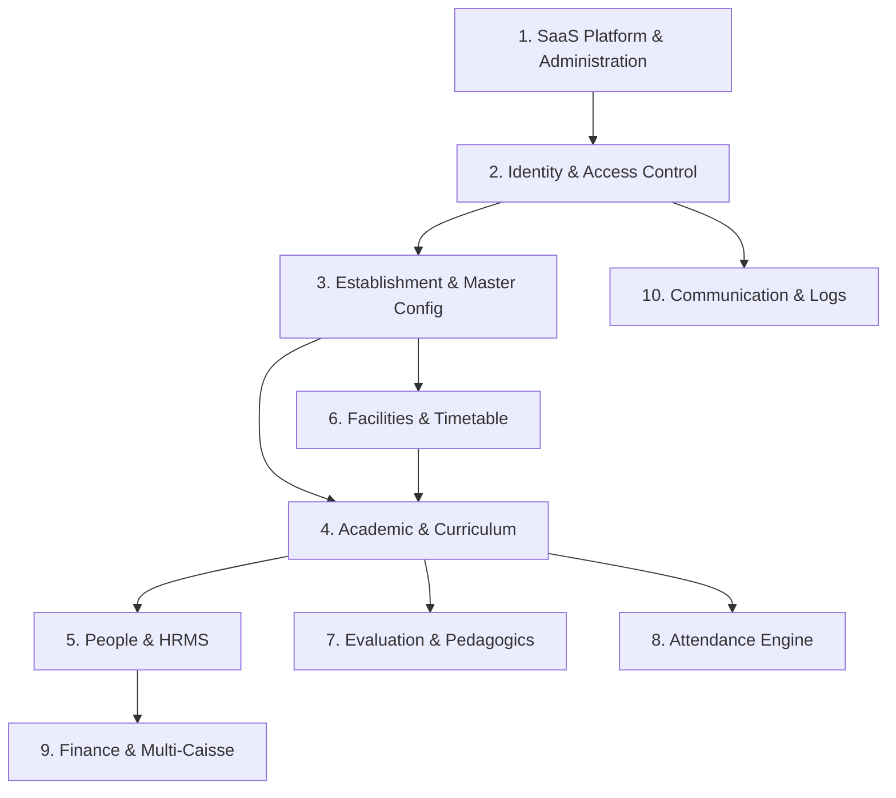

# BSofts-School — Domain Architecture & Service Boundaries

> Comprehensive specification of the 10 core functional domains, database models, NestJS services, and Next.js view routes.  
> **Last Updated**: 2026-09-22

---

## 1. Domains Overview

---

## 2. Detailed Domain Specifications

### Domain 1: SaaS Platform & Administration
* **Prisma Models**: `SaaSPlan`, `SaaSModule`, `SaaSPlanModule`, `SaaSPlanFeature`, `TenantPlanFeatureOverride`, `TenantSubscription`, `Tenant`, `TenantSettings`, `PlatformSetting`.
* **Backend Modules**: `saas-plans`, `saas-modules`, `tenants`, `tenant-subscriptions`, `platform-settings`, `saas-functions`.
* **Frontend Routes**: `/admin/tenants`, `/admin/subscriptions`, `/admin/plans`, `/admin/modules`, `/admin/functions`, `/admin/settings`.
* **Responsibilities**: Plan intervals, tenant provisioning, payment cycle management, platform branding, feature limits.

### Domain 2: Identity & Access Control (RBAC)
* **Prisma Models**: `User`, `Role`, `Permission`, `RolePermission`, `UserRoleAssignment`, `LoginLog`.
* **Backend Modules**: `auth`, `users`, `roles`, `permissions`, `role-permissions`, `user-roles`.
* **Frontend Routes**: `/admin/roles`, `/admin/permissions`, `/login`, `/register`, `/settings` (Profile & Security).
* **Responsibilities**: JWT token generation, refresh tokens, role assignment, permission checking, bcrypt hashing.

### Domain 3: Establishment & Master Configuration
* **Prisma Models**: `Establishment`, `EstablishmentConfig`, `GraduationConfig`, `DynamicEnum`, `SmtpConfig`, `NotificationTemplate`, `NotificationConfig`, `PaymentConfig`.
* **Backend Modules**: `establishments`, `dynamic-enums`, `mail`.
* **Frontend Routes**: `/establishments`, `/admin/settings`.
* **Responsibilities**: Multi-campus registry, dynamic dropdown lookup engine (`/dynamic-enums/category/:category`), dynamic SMTP mail delivery.

### Domain 4: Academic Hierarchy & Curriculum
* **Prisma Models**: `AcademicYear`, `AcademicPeriod`, `ClassLevel`, `Class`, `AcademicModule`, `ClassModuleAssignment`, `Matiere`.
* **Backend Modules**: `academic-years`, `academic-periods`, `class-levels`, `classes`, `academic-modules`, `matieres`.
* **Frontend Routes**: `/classes`, `/classes/promotion`, `/academic-modules`.
* **Responsibilities**: Cycles (Primary/Middle/High), Trimester/Semester terms, Class creation, Subject coefficients, promotion deliberations.

### Domain 5: People & HRMS
* **Prisma Models**: `Student`, `Parent`, `StudentParent`, `StudentClassAssignment`, `Teacher`, `TeacherMatiere`, `TeacherContract`, `TeacherLeave`, `Employee`, `EmployeeContract`.
* **Backend Modules**: `students`, `parents`, `teachers`, `teacher-contracts`, `teacher-leaves`, `employees`, `employee-contracts`.
* **Frontend Routes**: `/students`, `/teachers`, `/parents`, `/employees`, `/portal/student`, `/portal/teacher`, `/portal/parent`.
* **Responsibilities**: Complete student dossiers, parent guardianships, teacher assignments, staff employment contracts, payroll tracking.

### Domain 6: Facilities & Timetabling
* **Prisma Models**: `Room`, `RoomEquipment`, `Holiday`, `Session`.
* **Backend Modules**: `rooms`, `holidays`, `sessions`.
* **Frontend Routes**: `/rooms`, `/holidays`, `/schedule`.
* **Responsibilities**: Classroom capacities and equipment, vacation calendars, 3-tier collision avoidance (teacher, class, room).

### Domain 7: Evaluation & Pedagogics
* **Prisma Models**: `Lesson`, `Homework`, `Exam`, `ExamQuestion`, `ExamSubmission`, `ExamAnswer`, `Note`, `Bulletin`.
* **Backend Modules**: `lessons`, `homework`, `exams`, `notes`, `bulletins`.
* **Frontend Routes**: `/exams`, `/homework`.
* **Responsibilities**: 40% Continuous Control + 60% Exam weighting, bulletin generation with Rachat deliberation, online homework distribution.

### Domain 8: Attendance Engine
* **Prisma Models**: `StudentAttendance`, `TeacherAttendance`.
* **Backend Modules**: `student-attendance`, `teacher-attendance`.
* **Frontend Routes**: `/attendance`.
* **Responsibilities**: Session-level attendance, absence alert dispatch to parents, attendance statistics.

### Domain 9: Finance & Multi-Caisse
* **Prisma Models**: `Caisse`, `FinancialTransaction`, `StudentPayment`, `PaymentPlan`, `TeacherPayment`, `ProfitLoss`.
* **Backend Modules**: `caisses`, `financial-transactions`, `student-payments`, `payment-plans`, `teacher-payments`.
* **Frontend Routes**: `/payments`, `/payments/caisse`.
* **Responsibilities**: Cash drawer tracking, atomic inter-caisse transfers, student tuition receipts, teacher payroll calculations, millimes precision (TND).

### Domain 10: Communication & Logs
* **Prisma Models**: `Conversation`, `ConversationParticipant`, `Message`, `Notification`, `AuditLog`, `SystemLog`.
* **Backend Modules**: `messages`, `notifications`, `audit-logs`, `system-logs`, `meetings`.
* **Frontend Routes**: `/community/messages`, `/community/notifications`, `/community/meetings`, `/admin/audit-logs`, `/admin/system-logs`.
* **Responsibilities**: Direct messaging channels, notification broadcasting, audit trails, system error monitoring and resolution.
