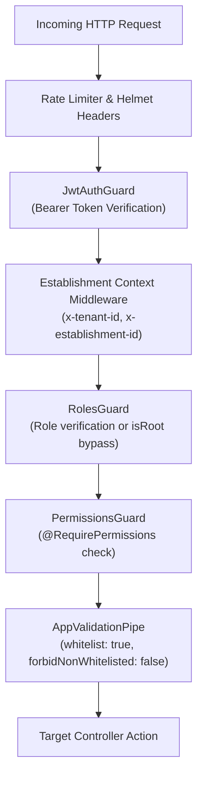

# BSofts-School — Security Architecture & Governance

> Enterprise security policies: 4-tier guard chain, multi-tenancy isolation, JWT lifecycle, password hashing, and role permissions matrix.  
> **Last Updated**: 2026-09-22

---

## 1. Guard Architecture & Request Pipeline

---

## 2. Multi-Tenant Scoping Rules

1. **Establishment Header Scoping**:
   * Every request includes `x-establishment-id` and `x-tenant-id`.
   * Standard users can ONLY query and mutate data belonging to their assigned `establishmentId`.
   * Root Administrators (`isRoot: true`) bypass establishment scoping when `x-establishment-id: ALL` is set.
2. **Actor Auditing**:
   * Mutations record `createdBy` and `updatedBy` directly from the authenticated JWT token (`req.user.id`).
   * Frontends must NEVER dictate `approvedBy` or `createdBy` via request body; backend services strictly overwrite these from the session token.

---

## 3. Password Security & Cryptography

* **Bcrypt Hashing**: All passwords are encrypted with bcrypt using a salt round cost of 10.
* **No Plaintext Passwords**: Password hashes are strictly excluded from all queries returned to the frontend (`select: { password: false }`).
* **Password Change Protocol**:
  * Requires `oldPassword` and `newPassword`.
  * Verifies `oldPassword` via `bcrypt.compare()`.
  * Verifies `newPassword` minimum length (8+ characters) before hashing.

---

## 4. Deletion & Trash Recovery Protocol

* **Soft-Delete (Standard Operation)**:
  * Updates `isDeleted = true`, `deletedAt = new Date()`, `deletedBy = user.id`.
  * Inactive items are excluded by default (`where: { isDeleted: false }`).
  * Available to all authorized staff roles.
* **Permanent Deletion (Root-Only)**:
  * Query param: `?permanent=true`.
  * Executed only if `user.isRoot === true`.
  * If foreign key relations exist, errors are trapped and logged to `SystemLog` without crashing the application.
