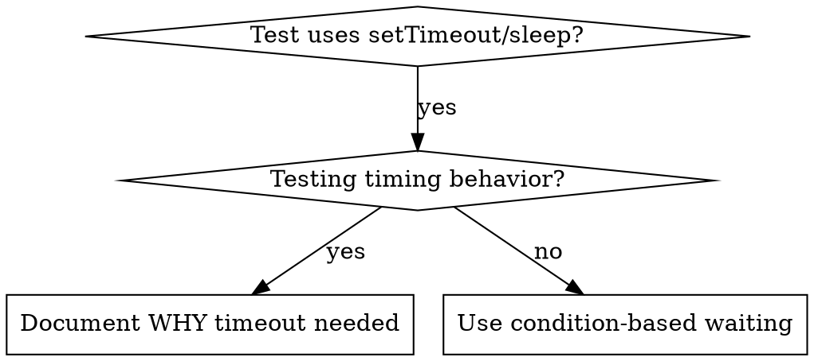

# Condition-Based Waiting

## Overview

Flaky tests often guess at timing with arbitrary delays. This creates race conditions where tests pass on fast machines but fail under load or in CI.

**Core principle:** Wait for the actual condition you care about, not a guess about how long it takes.

## When to Use



**Use when:**
- Tests have arbitrary delays (`setTimeout`, `sleep`, `time.sleep()`)
- Tests are flaky (pass sometimes, fail under load)
- Tests timeout when run in parallel
- Waiting for async operations to complete

**Don't use when:**
- Testing actual timing behavior (debounce, throttle intervals)
- Always document WHY if using arbitrary timeout

## Core Pattern

```typescript
// ❌ BEFORE: Guessing at timing
await new Promise(r => setTimeout(r, 50));
const result = getResult();
expect(result).toBeDefined();

// ✅ AFTER: Waiting for condition
await waitFor(() => getResult() !== undefined);
const result = getResult();
expect(result).toBeDefined();
```

## Quick Patterns

| Scenario | Pattern |
|----------|---------|
| Wait for event | `waitFor(() => events.find(e => e.type === 'DONE'))` |
| Wait for state | `waitFor(() => machine.state === 'ready')` |
| Wait for count | `waitFor(() => items.length >= 5)` |
| Wait for file | `waitFor(() => fs.existsSync(path))` |
| Complex condition | `waitFor(() => obj.ready && obj.value > 10)` |

## Implementation

Generic polling function:
```typescript
async function waitFor<T>(
  condition: () => T | undefined | null | false,
  description: string,
  timeoutMs = 5000
): Promise<T> {
  const startTime = Date.now();

  while (true) {
    const result = condition();
    if (result) return result;

    if (Date.now() - startTime > timeoutMs) {
      throw new Error(`Timeout waiting for ${description} after ${timeoutMs}ms`);
    }

    await new Promise(r => setTimeout(r, 10)); // Poll every 10ms
  }
}
```

See `condition-based-waiting-example.ts` in this directory for complete implementation with domain-specific helpers (`waitForEvent`, `waitForEventCount`, `waitForEventMatch`) from actual debugging session.

## Common Mistakes

**❌ Polling too fast:** `setTimeout(check, 1)` - wastes CPU
**✅ Fix:** Poll every 10ms

**❌ No timeout:** Loop forever if condition never met
**✅ Fix:** Always include timeout with clear error

**❌ Stale data:** Cache state before loop
**✅ Fix:** Call getter inside loop for fresh data

## When Arbitrary Timeout IS Correct

```typescript
// Tool ticks every 100ms - need 2 ticks to verify partial output
await waitForEvent(manager, 'TOOL_STARTED'); // First: wait for condition
await new Promise(r => setTimeout(r, 200));   // Then: wait for timed behavior
// 200ms = 2 ticks at 100ms intervals - documented and justified
```

**Requirements:**
1. First wait for triggering condition
2. Based on known timing (not guessing)
3. Comment explaining WHY

## Real-World Impact

From debugging session (2025-10-03):
- Fixed 15 flaky tests across 3 files
- Pass rate: 60% → 100%
- Execution time: 40% faster
- No more race conditions


---

## 🛠️ Mandatory Workspace & Governance Directives (Upgraded Standards)

1. **Project Root & Paths**: Primary project workspace is E:\ToDo\BSofts.
2. **Auxiliary Workspace Directory Layout (.agents/bonus/)**:
   - **Scratch**: E:\ToDo\BSofts\.agents\bonus\Scratch — Scripting directory for creating temporary JS/TS scripts to inspect, verify, extract, or audit database & API components.
   - **Output**: E:\ToDo\BSofts\.agents\bonus\Scratch\Output — Deliverable directory for exported reports, data dumps, and persistent deliverables.
   - **Vault**: E:\ToDo\BSofts\.agents\bonus\Vault — Persistent memory vault directory holding state files (README.md, STATUS.md, PROGRESS.md, DECISIONS.md, DECLARATIONS.md, PROJECT.md).
3. **Autonomous Execution Loop (Rule #12)**:
   [1. Receive Goal] ➔ [2. Work & Implement] ➔ [3. Check & Verify (tsc --noEmit)] ➔ [4. Re-work if not complete] ➔ [5. Deliver Result] ➔ [6. Update Vault Memos].
4. **Autonomous Execution Permissions (Rule #13)**: Full permission to read, write, create, move files, and execute scripts/commands under E:\ToDo\BSofts without asking for permission.
5. **Mandatory Deletion Confirmation Guard (Rule #14)**: MUST ALWAYS ask user for explicit confirmation before deleting any file, folder, or database table.
6. **Zero Database Data Loss Guard (Rule #15)**: NEVER run commands that accept database data loss (such as prisma db push --accept-data-loss or forced table drops).


---

## 👥 BSOFT 5-Actor Role Architecture & Permanent Deletion Governance

1. **Developer (System Developer / Me)**:
   - Full platform god-mode access across all companies, tenants, endpoints, and system settings.
   - **Exclusive Permanent Deletion Authority**: Hard permanent deletes can ONLY be executed by Developer users. Non-developer delete requests default to soft-delete or throw ForbiddenException.
2. **Super Admin (Subscription Buyer & Owner)**:
   - Buyer of the SaaS subscription for his company/companies.
   - Full administrative control and feature configuration for his own company/companies only.
3. **Admin (Company Administrator)**:
   - Highest operational authority in a specific company right after Super Admin.
   - Manages day-to-day operations, employees, inventory, sales, and finance within his assigned company.
4. **Employees (Company Staff)**:
   - Operational staff members (Sales Agent, Accountant, Warehouse Manager) with role-restricted permissions.
5. **Third Parties (Clients & Providers / Suppliers)**:
   - External Customers (CLIENT) and Suppliers (FOURNISSEUR) operating in **Spectator Mode** — consult-only access restricted strictly to their own related records.

7. **Permanent Recursive File System Access Guarantee (Rule #16)**: Permanent, unrestricted, recursive read, write, create, and move permissions across all files, directories, subdirectories, and nested paths under E:\ToDo\BSofts at all times without asking for confirmation.
