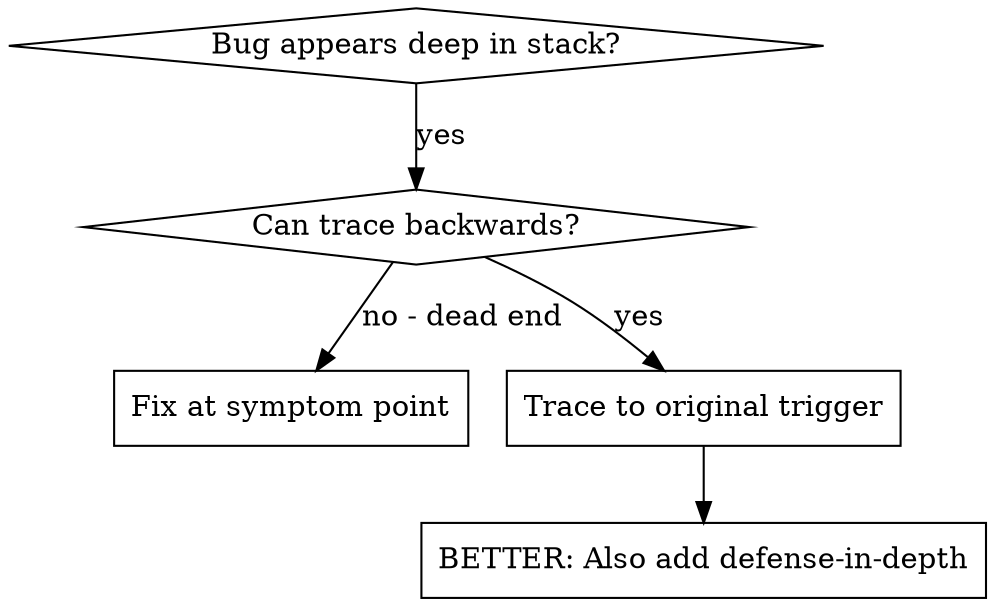
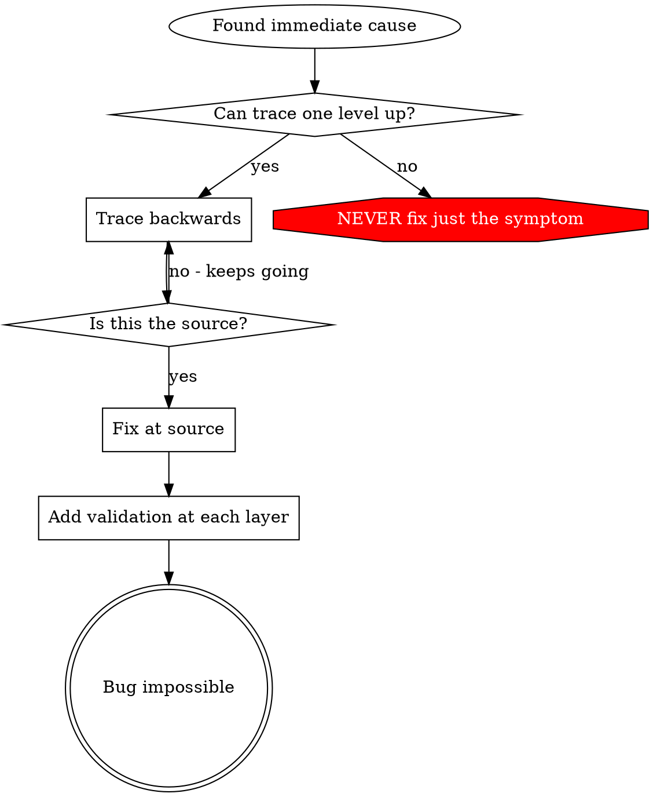

# Root Cause Tracing

## Overview

Bugs often manifest deep in the call stack (git init in wrong directory, file created in wrong location, database opened with wrong path). Your instinct is to fix where the error appears, but that's treating a symptom.

**Core principle:** Trace backward through the call chain until you find the original trigger, then fix at the source.

## When to Use



**Use when:**
- Error happens deep in execution (not at entry point)
- Stack trace shows long call chain
- Unclear where invalid data originated
- Need to find which test/code triggers the problem

## The Tracing Process

### 1. Observe the Symptom
```
Error: git init failed in /Users/jesse/project/packages/core
```

### 2. Find Immediate Cause
**What code directly causes this?**
```typescript
await execFileAsync('git', ['init'], { cwd: projectDir });
```

### 3. Ask: What Called This?
```typescript
WorktreeManager.createSessionWorktree(projectDir, sessionId)
  → called by Session.initializeWorkspace()
  → called by Session.create()
  → called by test at Project.create()
```

### 4. Keep Tracing Up
**What value was passed?**
- `projectDir = ''` (empty string!)
- Empty string as `cwd` resolves to `process.cwd()`
- That's the source code directory!

### 5. Find Original Trigger
**Where did empty string come from?**
```typescript
const context = setupCoreTest(); // Returns { tempDir: '' }
Project.create('name', context.tempDir); // Accessed before beforeEach!
```

## Adding Stack Traces

When you can't trace manually, add instrumentation:

```typescript
// Before the problematic operation
async function gitInit(directory: string) {
  const stack = new Error().stack;
  console.error('DEBUG git init:', {
    directory,
    cwd: process.cwd(),
    nodeEnv: process.env.NODE_ENV,
    stack,
  });

  await execFileAsync('git', ['init'], { cwd: directory });
}
```

**Critical:** Use `console.error()` in tests (not logger - may not show)

**Run and capture:**
```bash
npm test 2>&1 | grep 'DEBUG git init'
```

**Analyze stack traces:**
- Look for test file names
- Find the line number triggering the call
- Identify the pattern (same test? same parameter?)

## Finding Which Test Causes Pollution

If something appears during tests but you don't know which test:

Use the bisection script `find-polluter.sh` in this directory:

```bash
./find-polluter.sh '.git' 'src/**/*.test.ts'
```

Runs tests one-by-one, stops at first polluter. See script for usage.

## Real Example: Empty projectDir

**Symptom:** `.git` created in `packages/core/` (source code)

**Trace chain:**
1. `git init` runs in `process.cwd()` ← empty cwd parameter
2. WorktreeManager called with empty projectDir
3. Session.create() passed empty string
4. Test accessed `context.tempDir` before beforeEach
5. setupCoreTest() returns `{ tempDir: '' }` initially

**Root cause:** Top-level variable initialization accessing empty value

**Fix:** Made tempDir a getter that throws if accessed before beforeEach

**Also added defense-in-depth:**
- Layer 1: Project.create() validates directory
- Layer 2: WorkspaceManager validates not empty
- Layer 3: NODE_ENV guard refuses git init outside tmpdir
- Layer 4: Stack trace logging before git init

## Key Principle



**NEVER fix just where the error appears.** Trace back to find the original trigger.

## Stack Trace Tips

**In tests:** Use `console.error()` not logger - logger may be suppressed
**Before operation:** Log before the dangerous operation, not after it fails
**Include context:** Directory, cwd, environment variables, timestamps
**Capture stack:** `new Error().stack` shows complete call chain

## Real-World Impact

From debugging session (2025-10-03):
- Found root cause through 5-level trace
- Fixed at source (getter validation)
- Added 4 layers of defense
- 1847 tests passed, zero pollution


---

## 🛠️ Mandatory Workspace & Governance Directives (Upgraded Standards)

1. **Project Root & Paths**: Primary project workspace is E:\ToDo\BSofts.
2. **Auxiliary Workspace Directory Layout (.agents/bonus/)**:
   - **Scratch**: E:\ToDo\BSofts\.agents\bonus\Scratch — Scripting directory for creating temporary JS/TS scripts to inspect, verify, extract, or audit database & API components.
   - **Output**: E:\ToDo\BSofts\.agents\bonus\Scratch\Output — Deliverable directory for exported reports, data dumps, and persistent deliverables.
   - **Vault**: E:\ToDo\BSofts\.agents\bonus\Vault — Persistent memory vault directory holding state files (README.md, STATUS.md, PROGRESS.md, DECISIONS.md, DECLARATIONS.md, PROJECT.md).
3. **Autonomous Execution Loop (Rule #12)**:
   [1. Receive Goal] ➔ [2. Work & Implement] ➔ [3. Check & Verify (tsc --noEmit)] ➔ [4. Re-work if not complete] ➔ [5. Deliver Result] ➔ [6. Update Vault Memos].
4. **Autonomous Execution Permissions (Rule #13)**: Full permission to read, write, create, move files, and execute scripts/commands under E:\ToDo\BSofts without asking for permission.
5. **Mandatory Deletion Confirmation Guard (Rule #14)**: MUST ALWAYS ask user for explicit confirmation before deleting any file, folder, or database table.
6. **Zero Database Data Loss Guard (Rule #15)**: NEVER run commands that accept database data loss (such as prisma db push --accept-data-loss or forced table drops).


---

## 👥 BSOFT 5-Actor Role Architecture & Permanent Deletion Governance

1. **Developer (System Developer / Me)**:
   - Full platform god-mode access across all companies, tenants, endpoints, and system settings.
   - **Exclusive Permanent Deletion Authority**: Hard permanent deletes can ONLY be executed by Developer users. Non-developer delete requests default to soft-delete or throw ForbiddenException.
2. **Super Admin (Subscription Buyer & Owner)**:
   - Buyer of the SaaS subscription for his company/companies.
   - Full administrative control and feature configuration for his own company/companies only.
3. **Admin (Company Administrator)**:
   - Highest operational authority in a specific company right after Super Admin.
   - Manages day-to-day operations, employees, inventory, sales, and finance within his assigned company.
4. **Employees (Company Staff)**:
   - Operational staff members (Sales Agent, Accountant, Warehouse Manager) with role-restricted permissions.
5. **Third Parties (Clients & Providers / Suppliers)**:
   - External Customers (CLIENT) and Suppliers (FOURNISSEUR) operating in **Spectator Mode** — consult-only access restricted strictly to their own related records.

7. **Permanent Recursive File System Access Guarantee (Rule #16)**: Permanent, unrestricted, recursive read, write, create, and move permissions across all files, directories, subdirectories, and nested paths under E:\ToDo\BSofts at all times without asking for confirmation.
